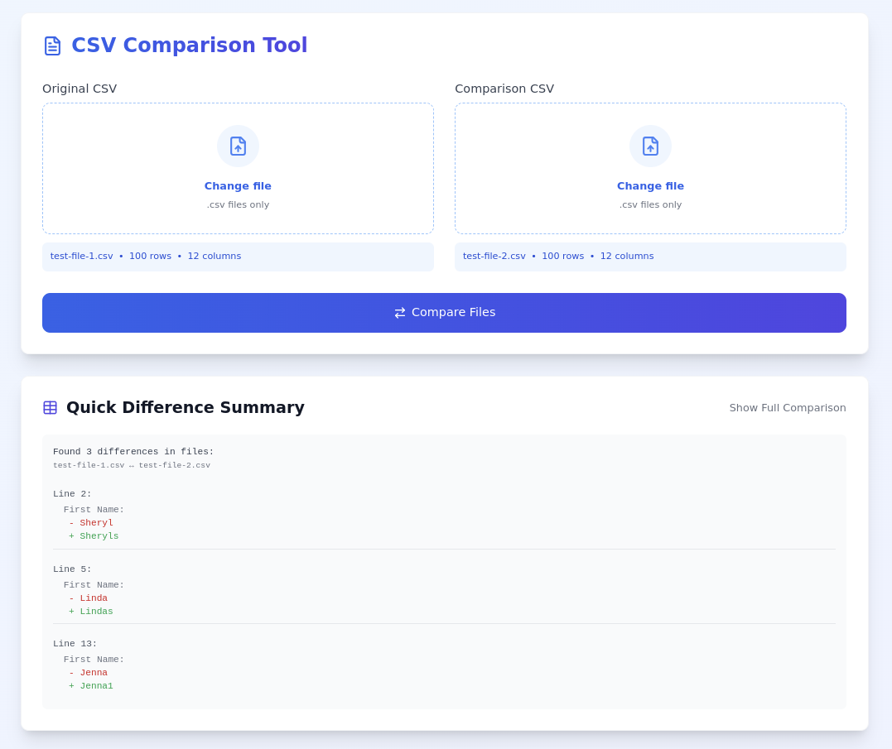
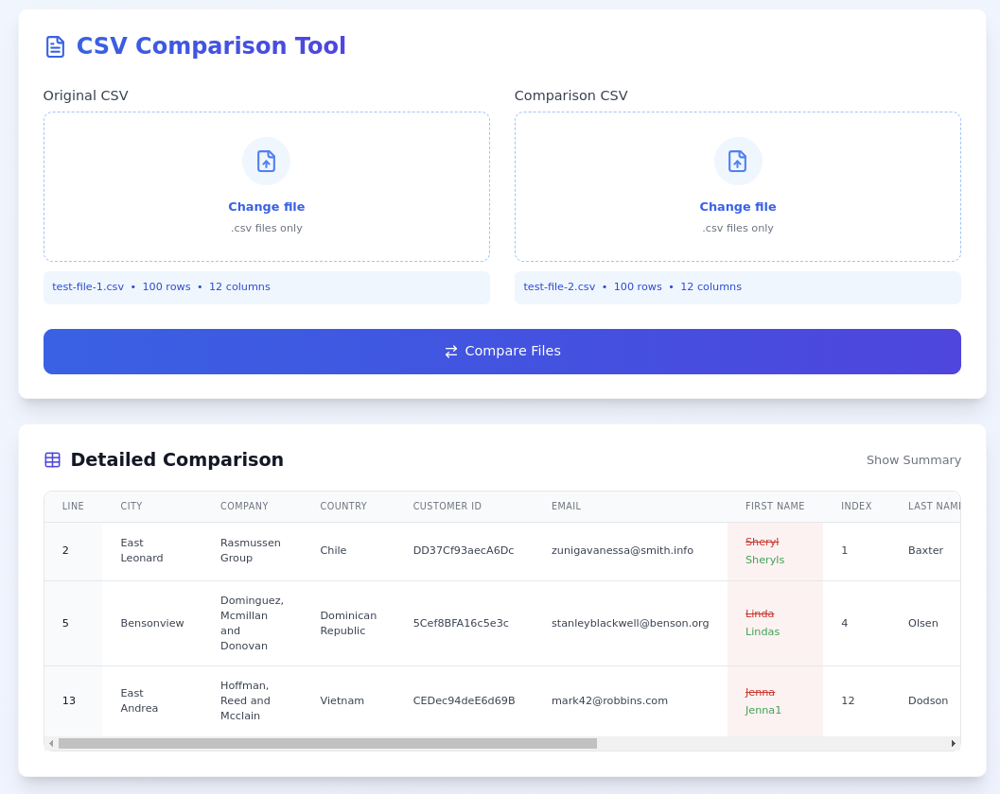

# CSV Comparison Tool

[](https://opensource.org/licenses/Apache-2.0)  [](https://reactjs.org/)  [](https://www.typescriptlang.org/)  [](https://vitejs.dev/)  [](https://tailwindcss.com/)  [](CONTRIBUTING.md)

A modern, user-friendly web application for comparing two CSV files and identifying differences between them. Built with React, TypeScript, and Tailwind CSS.

## Features

- Compare two CSV files side by side
- Identify differences in content and structure
- Fully responsive design for mobile and desktop
- Fast, client-side processing
- No data uploaded to servers - all processing done locally
- Beautiful, modern UI with smooth transitions
- Detailed and summary views of differences
- Real-time validation and error handling





## Getting Started

1. Clone the repository
2. Install dependencies:
   ```bash
   npm install
   ```
3. Start the development server:
   ```bash
   npm run dev
   ```

## Usage

1. Click "Select CSV" to upload your first CSV file
2. Upload a second CSV file for comparison
3. Click "Compare Files" to see the differences
4. Toggle between summary and detailed views
5. Review differences highlighted in red/green

## Technical Details

- **Frontend**: React 18 with TypeScript
- **Styling**: Tailwind CSS
- **CSV Parsing**: Papa Parse
- **Icons**: Lucide React
- **Build Tool**: Vite


## Creator

Ed Bates (TECHBLIP LLC)

## Acknowledgments

Some sections of this code were generated with the assistance of AI tools.   These contributions were reviewed and integrated by the project creator(s).

## License

Apache-2.0 license - see the [LICENSE](LICENSE) file for details